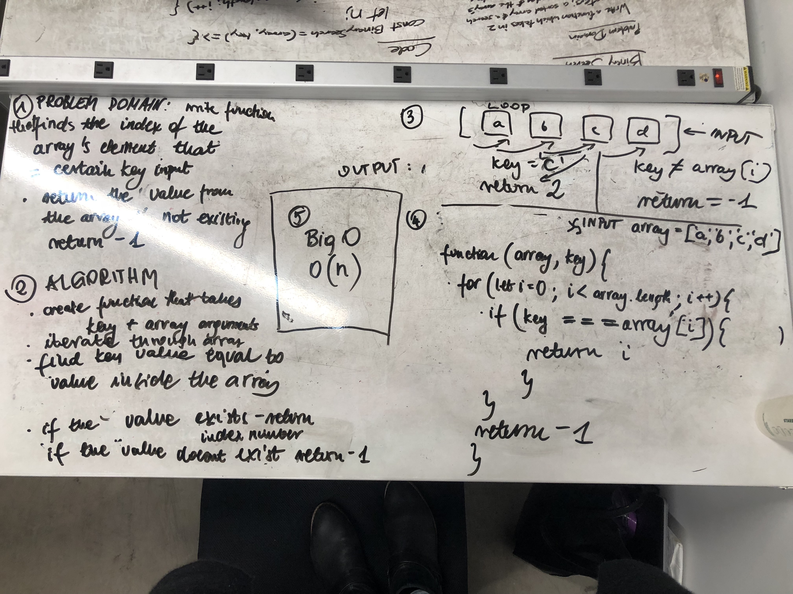

# Reverse an Array
The trick to solve this assignment was to iterate through the array and compare the key value with the array values. If key value was included inside the array then we return the index number of this value. If not we return -1. 

## Solution
