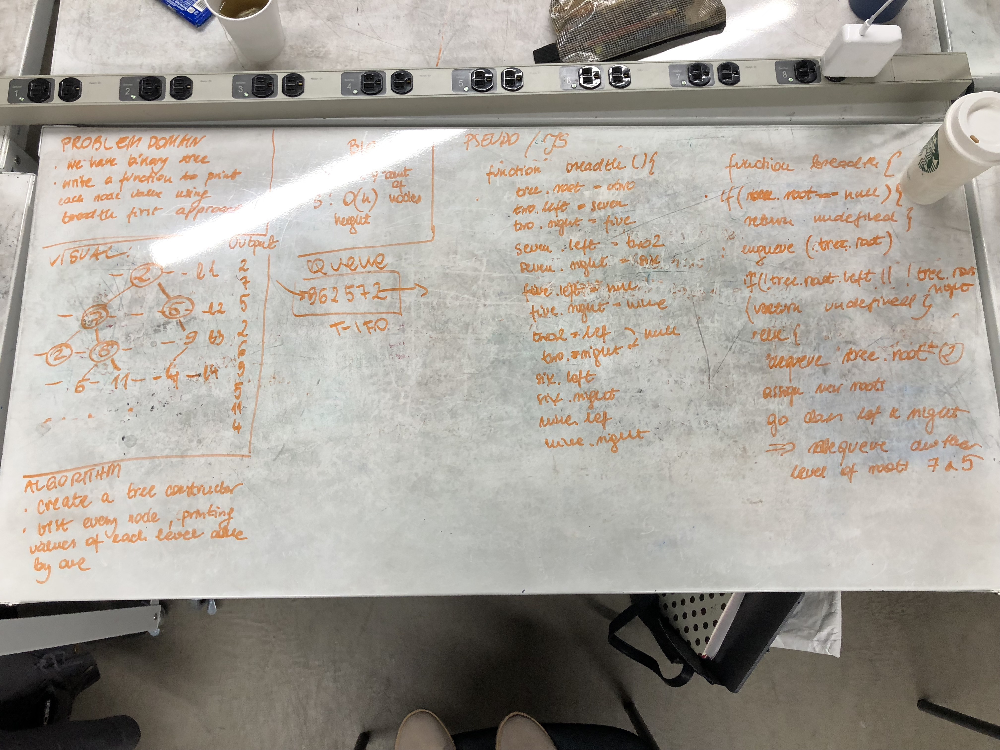

# breadth-first-traversal
The function that I created builds a binary tree and prints a value of each node from the same level as a string. I decided to use queues methods: push and shift function on the array to collect values and return them later. 

## Solution
