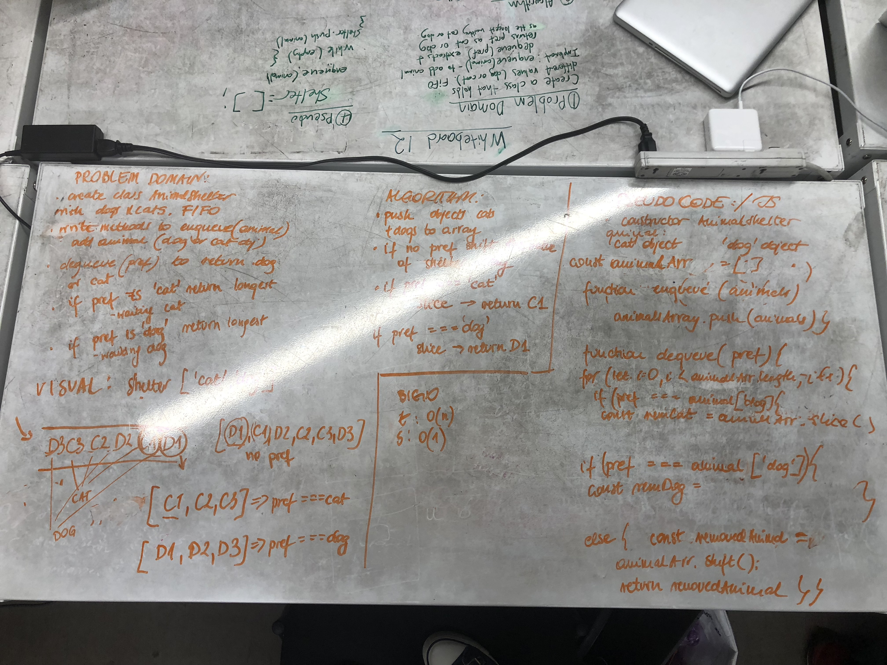

# Reverse an Array
The methods that I have build pushes animal objects to the array to create  Queue. I manipulate them with push, shift and splice method to find the longest waiting animal inside the animalArr array and remove it. Since it is a queue it will be the animal that came into the array first.

## Solution
