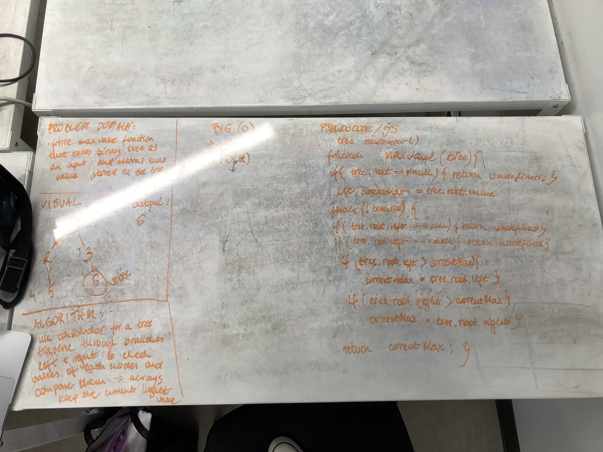

# find-max-value
This is the function that searches through all the binary tree nodes for the maximum value. I compare each node value to the previous maximum value and if it is higher it stays as a current max value.
 

## Solution
