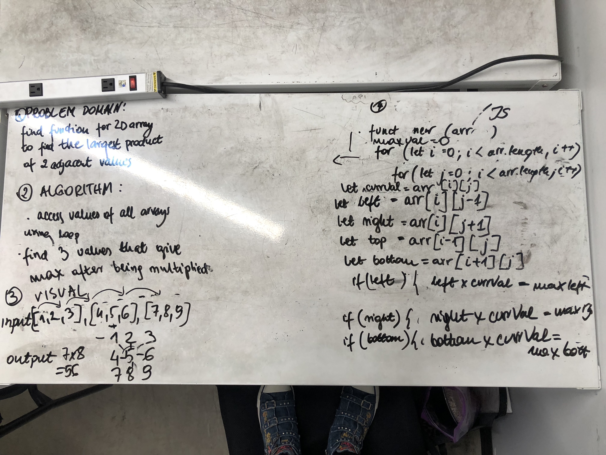

# Reverse an Array
The way to solve this problem was to use looping through the 2D array to find all the array values that are adjascent to the current value and calculate them to find the largest product of all the arrays. The important issue was to remember about eliminating the undefined values from the iteration.

## Solution
