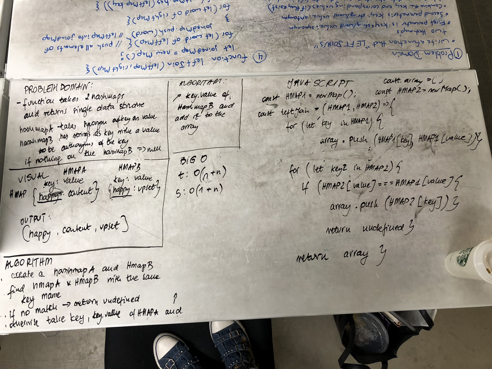

# Left Join
This function takes 2 hashmaps as parameters and left joins both of them into a single object. I used map objects from ES6 to create a new object with 2 values inside the array.

## Solution
