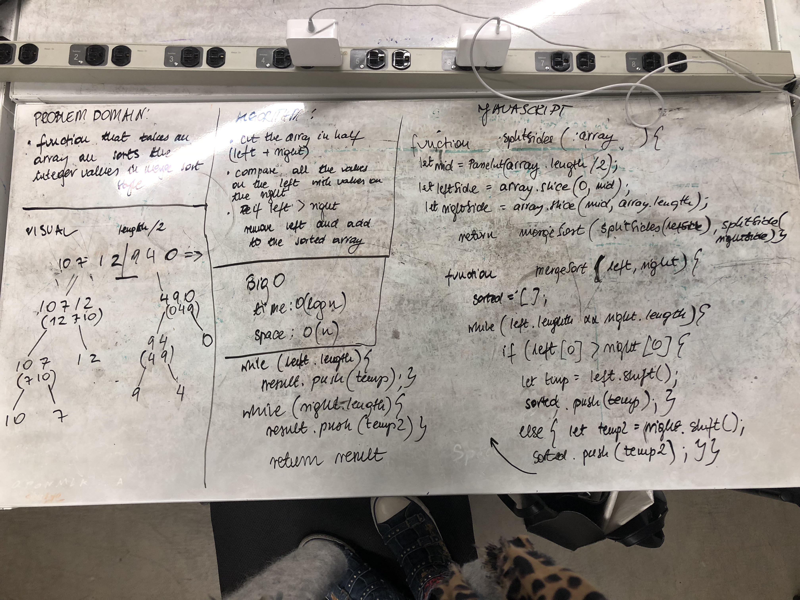

# Merge Sort
This type of sorting takes an array and slices it into halves (left and right) until single element is in the array. Then it compares each element from the left side to the one on the right side and if left side element is smaller or the same as the right one then we shift it from the initial array and push it into a new array until all the elements from initial array are there and the array is sorted.

## Solution
