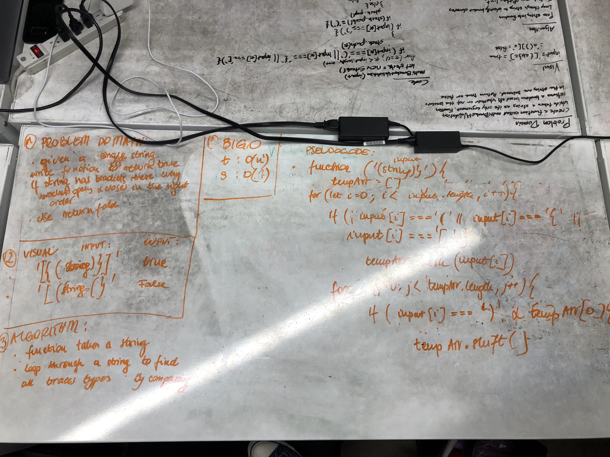

# multi-bracket-validation
The application that I have build searches for braces that match in the right order. The idea was to push the front braces to the stack and loop in the reverse order through the string to find the match for the opening brace. If I do, then the element gets removed until the array is empty which means that we will return true, otherwise false.

## Solution
