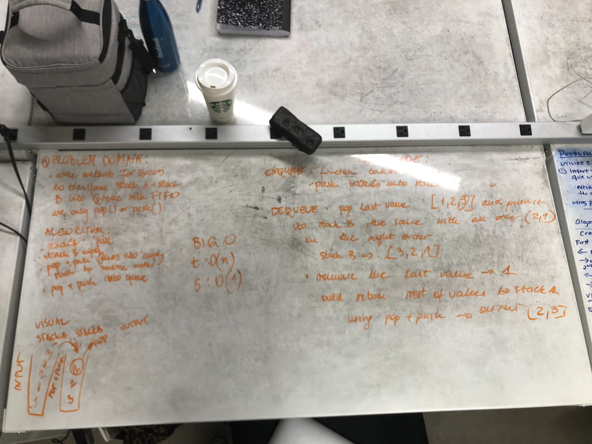

# Reverse an Array
The methods that I have build push values to the array to create 2 stacks. I manipulate them with push and pop methods to reverse the order and give them properties of Queues. So first in first out.

## Solution
