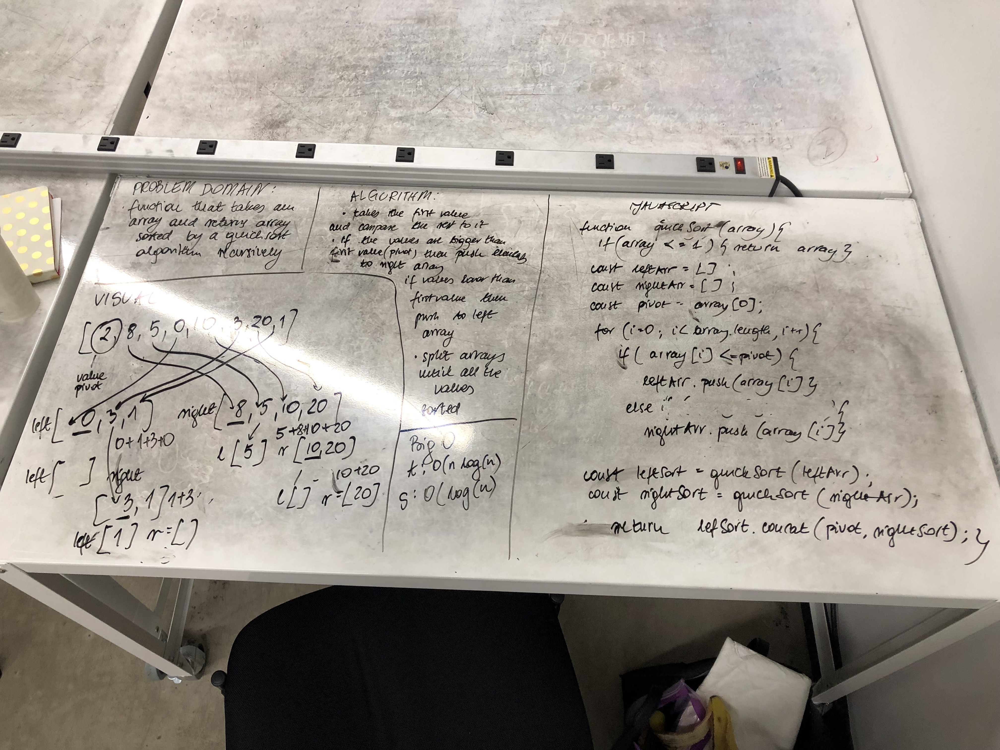

# Quick Array
This function takes an array as a parameter and returns sorted array. This is a quick-sort which means we take the first element(pivot) of the array and compare the rest of the array values to this one. If other elements are smaller than pivot value then we push them into a leftArray and if greater, into the rightArray. 
This happens recursively until there are only single values in the left and right arrays. Finally all the values get concatenated and added to the sortedArray.

## Solution
