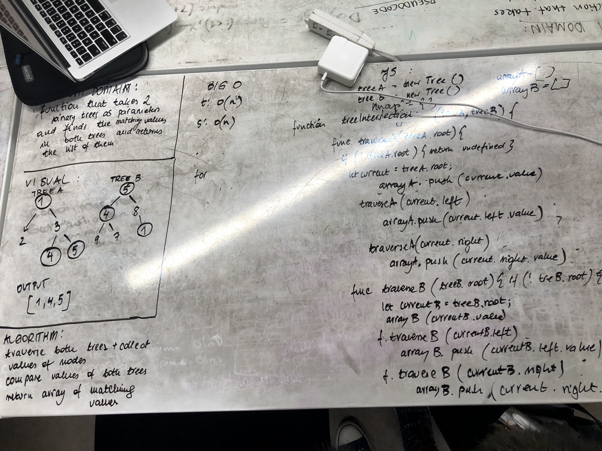

# tree-intersections
The function that I created builds two binary trees and checks for the node values that are math both trees. First we traverse in pre-order style through the treeA and assign all the values into the map objects. Next traversing through treeB we compare the values with treeA and if there is a match, this value is added to an array. Function returns an array.

## Solution
